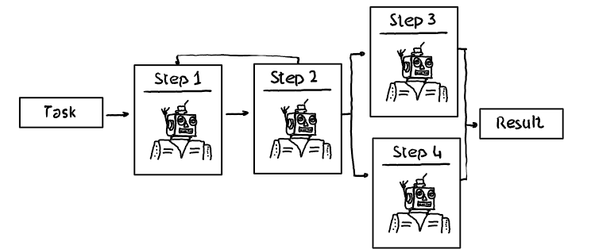

# AzureAI - Agent Group Chat vs. Process Framework

## Introduction

With the rise of LLMs and SLMs, AI enrichment of existing legacy and business applications has become a top priority for every developer. 

The emergence of agentic behavior, or the use of "AI Agents," is particularly noteworthy. However, developers must carefully consider whether agentic behavior is the best approach when building new applications or enhancing existing ones with AI. 

While AI Agents can offer significant benefits, other design patterns like "Process Frameworks" might be a better fit based on the specific needs and goals of the application.

## Agents / Group Chat

Agent Group Chat is a common architecture where multiple AI-enabled functionalities (or Agents), specialized to perform specific tasks, collaborate to solve problems.

Within this framework, two subcategories can be identified:

- Orchestrator pattern: where one Agent understands the task and directs other agents based on instructions,
- Self-aware pattern, where agents independently check existing tasks and available information and contribute to solving the task.

## Process Framework

Existing business applications and applications, in general, typically require adherence to a clearly defined 'flows' or process statements. 

This structured sequence ensures that tasks are completed in a logical and organized manner. Additionally, specific tasks within these applications will, for sure, utilize AI functionality to perform their operations.

For example, when opening a bank account, customers must follow a series of predefined steps, such as verifying their identity, providing personal information, and agreeing to terms and conditions. Each step must be executed in a specific order with a clear defined sequence.

## Repo Content

This repository demonstrates a streamlined method for obtaining the results of a sports event, showcasing two implementation approaches:

- through an agent group chat
- and a flow of tasks or a process flow

The provided sample shows how the winning team and the final score for a specified event can be retrieved using both patterns.

| File | Description | Details |
| ---- | ----------- | ------- |
| [setup.azcli](./setup/setup.azcli) | An Azure CLI powershell file to create the necessary Azure environment | A resource group with an instance of Azure OpenAI with a GPT-4o model instance will be created and all necessary connection information will be stored in in the folder [config](./config/) |
| [Agent_Execute_GroupChat](./src/Agent_Execute_GroupChat.ipynb) | A polyglot notebook which creates and executes the Agent group chat | The notebook uses c# to highlight the functionality. Because Semantic Kernel supports Python and Java as well porting to one of those languages is easily possible |
| [Process_Execute_ProcessSteps](./src/Process_Execute_ProcessSteps.ipynb) | A polyglot notebook which creates and executes the Process flow | The notebook uses c# to highlight the functionality. Because Semantic Kernel supports Python and Java as well porting to one of those languages is easily possible |

### Agent Group Chat

The [Agent Group Chat Notebook](./src/Agent_Execute_GroupChat.ipynb) defines two Agents:

- the "Retrieve Winner Agent" and
- the "Retrieve Score Agent"

Both Agents are tasked with determining *"Who won the Super Sports Championship 2025"*, a fictional sport event with no available internet data. 
This setup highlights how private data can be leveraged to empower the agents. Consequently, both agents use LLM function calling to identify and execute local functions to retrieve the necessary information to answer the task.

As the name indicates, the "Retrieve Winner Agent" will retrieve the winner of the sport event, while the "Retrieve Score Agent" will retrieve the final score.

### Process Flow

The [Process Flow Notebook](./src/Process_Execute_ProcessSteps.ipynb) defines two process steps with one supporting process step:

- `retrieveWinnerProcessStep`: Defines the functionality to retrieve the winner of the sport event. 
- `retrieveScoreProcessStep`: Defines the functionality to retrieve the score of the sport event.
- `storeResultProcessStep`: Acts as supporting process step which can store winner and score and will finally show the result of the process flow.

All three steps are defined as classes with class functions, uses Semantic Kernel and the function calling possibilities of the deployed OpenAI GPT-4o model to identify and execute local functions.

## Summary

With the rise of LLMs and SLMs, developers prioritize AI enrichment of legacy and business applications.

The emergence of "AI Agents" offers significant benefits, but other design patterns like "Process Frameworks" might be more suitable based on specific application needs and goals.

Agent Group Chat architecture involves multiple AI-enabled functionalities collaborating to solve problems, while Process Frameworks adhere to clearly defined 'flows' ensuring logical and organized task completion. This repository demonstrates two implementation approaches for obtaining sports event results highlighting the pros and cons of each pattern.
